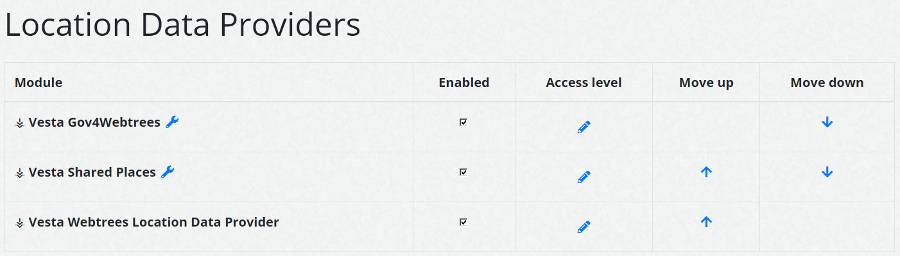

# ⚶ Vesta Places and Pedigree map (Webtrees 2 Custom Module)

This [webtrees](https://www.webtrees.net/) custom module provides replacements for the original 'Places' and 'Pedigree map' modules, using location data from GEDCOM, as well as location data provided by other modules.  
The project’s website is [cissee.de](https://cissee.de). 

This is a webtrees 2.x module - It cannot be used with webtrees 1.x. For its webtrees 1.x counterpart, see [here](https://github.com/ric2016/openstreetmap_hooked).

## Contents

* [Features](#features)
* [Download](#download)
* [Installation](#installation)
* [License](#license)

### Features<a name="features"/>

* This custom module displays the location of events and the birthplace of ancestors on a map.

* Location data is obtained directly from gedcom data, and may also be provided by other custom modules. 

* If you have collected non-GEDCOM location data via webtrees (Control panel > Map > Geographic data), activate the 'Vesta Webtrees Location Data Provider' custom module to make this data available.

* If you have multiple custom modules providing location data, you can change their priority via the module configuration:

### Download<a name="download"/>

* Current version: 2.0.11.0.0
* Based on and tested with webtrees 2.0.11. Requires webtrees 2.0.9 or later.
* Requires the ⚶ Vesta Common module ('vesta_common').
* Download the zipped module, including all related modules, [here](https://cissee.de/vesta.latest.zip).
* Support, suggestions, feature requests: <ric@richard-cissee.de>
* Issues also via <https://github.com/vesta-webtrees-2-custom-modules/vesta_places_and_pedigree_map/issues>
* Translations may be contributed via weblate: <https://hosted.weblate.org/projects/vesta-webtrees-custom-modules/>

### Installation

* Unzip the files and copy the contents of the modules_v4 folder to the respective folder of your webtrees installation. All related modules are included in the zip file. It's safe to overwrite the respective directories if they already exist (they are bundled with other custom modules as well), as long as other custom models using these dependencies are also upgraded to their respective latest versions.
* Enable the main module via Control Panel -> Modules -> All modules -> ⚶ OpenStreetMap.

### License<a name="license"/>

* **vesta_places_and_pedigree_map: a webtrees custom module**
* Copyright (C) 2019 – 2021 Richard Cissée
* Derived from **webtrees** - Copyright 2020 webtrees development team.
* Dutch translations provided by TheDutchJewel.
* Czech translations provided by Josef Prause.
* Further translations contributed via weblate.

This program is free software: you can redistribute it and/or modify
it under the terms of the GNU General Public License as published by
the Free Software Foundation, either version 3 of the License, or
(at your option) any later version.

This program is distributed in the hope that it will be useful,
but WITHOUT ANY WARRANTY; without even the implied warranty of
MERCHANTABILITY or FITNESS FOR A PARTICULAR PURPOSE. See the
GNU General Public License for more details.

You should have received a copy of the GNU General Public License
along with this program. If not, see <http://www.gnu.org/licenses/>.
